# Spotify Project
## Situation

As a huge fan of Lil Baby, I was wondering about his song's performance on Spotify.

To do so, I first of all searched for free datasets on Kaggle and I didn’t find one which is up-to-date and with useful information. After a few minutes of research on Google, I found that Spotify has a free API that we can access for free and extract information about artists, songs, albums, tracks, playlists, etc.

Therefore, as a passionate data engineer, I knew that I had to handle this end to end project.

## Summary

For this data engineering project we have done many things : 

- Extract the tracks and albums data from the Spotify API using Python and Libraries such as requests and json
- Do some transformation work on the data we extracted using Python and Pandas
- Create an IAM users on AWS and manage the Authorization
- Load the data in a S3 Bucket(object storage) on AWS
- Create EC2 instance on AWS to install and run Airflow on it, for the data orchestration and scheduling
- Find insights in data with the EDA

## Architecture
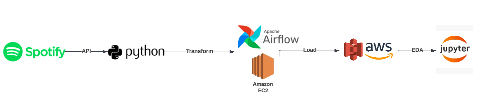

## Requirements

- Python
- An IDE (visual studio code for example)
- AWS account ( free trier )

## Extraction

For the extraction, we used the spotify API to extract current Lil Baby’s tracks and albums. 

To do so, we first of all created a spotify developers account to take the client_id and client_secret. 

In the Lil Baby’s tracks data, we extracted (column in the dataframe) : 

- track_name( string) : the name of the track
- duration_ms ( integer) : The track length in milliseconds.
- explitcit ( boolean ) : Whether or not the track has explicit lyrics ( true = yes it does; false = no it does not OR unknown).
- popularity ( integer ) : The popularity of the track. The value will be between 0 and 100, with 100 being the most popular.
- track_number ( integer ) :  The number of the track. If an album has several discs, the track number is the number on the specified disc.
- available_markets ( string ) : A list of the countries in which the track can be played
- artists_name ( string ) : The artists who performed the track
- artists_id (  string ) : The spotifyID of the artists
- album_name ( string ) : The name of the album.
- album_id ( string ) : The spotifyID of the album

In the albums data : 

- id ( string ) : The spotifyID of the album
- name ( string ) : The name of the album
- type ( string ) : The object type.
- release_data ( string ) : The date the album was first released.
- available_markets : A list of the countries in which the track can be played
- total_tracks ( string ): The number of tracks in the album.
- label ( string ) : • The label associated with the album.
- popularity ( integer ) : The popularity of the album. The value will be between 0 and 100, with 100 being the most popular.
- artist_name ( string ) : The artists who performed the album
- artist_id ( string ) :  The spotifyID of the artists

You can fine the extraction process in the [modules](http://modules.py).py  file of the modules folder.

## Transformation

There were no very important transformations to do on the two datasets ( tracks and albums ) we extracted.

For the track data :

- Clean the explicit column: replace 0 by False and 1 by True
- Convert the explicit column type to boolean

For the album data :

- Convert the release_date type to DateTime

## Load

Because we were going to back up our files to the cloud, we created an AWS account (free tier). After that, for security reasons (avoid using your root account for your project), we created an IAM user and then logged into it.**
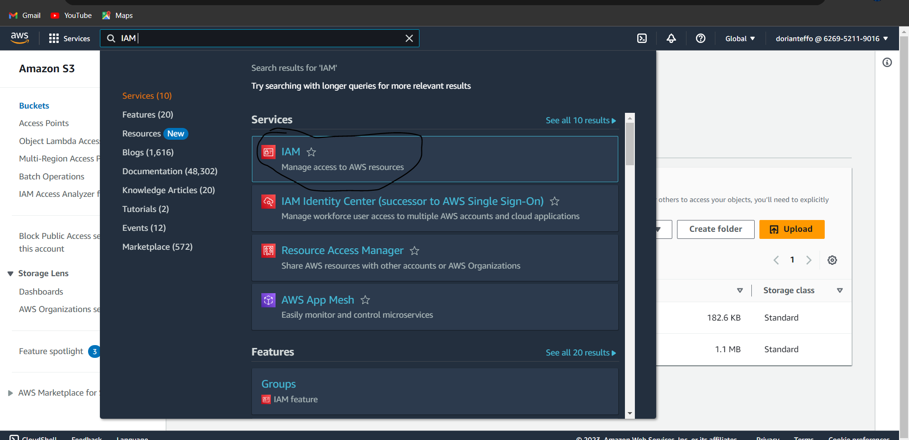
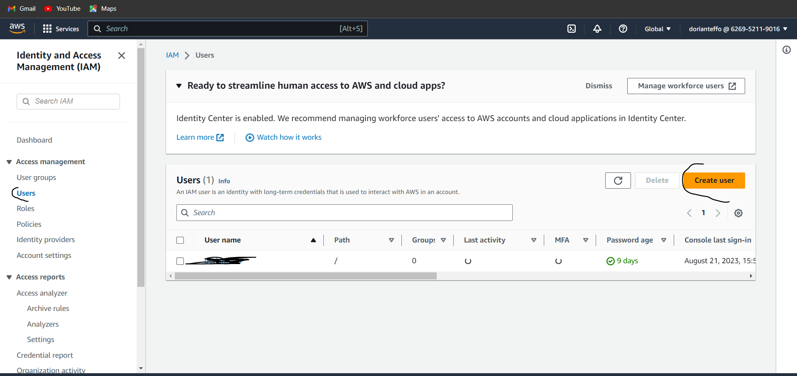

(When creating IAM users, you can simply select AdministratorAccess )
We then created an S3 bucket (just put the name and leave everything as default)
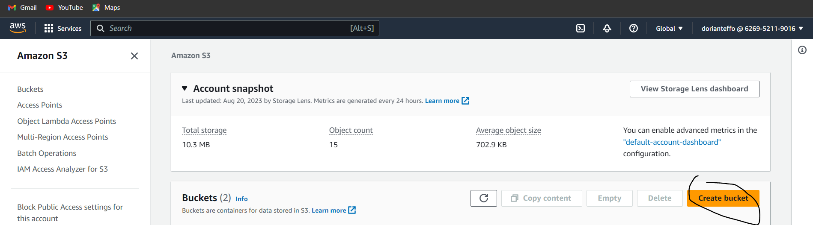

Using the s3fs library, we upload our data (csv format) to the Amazon Simple Storage Service ( S3 ) bucket that we created on the platform.
You can find the ETL process in the spotify_etl.py file.

## Orchestration

For this part, we used Apache AIRFLOW. We wrote the DAG code in the spotify_dag.py file.
To run our Airflow DAG, we created an AWS EC2 instance (create an IAM role on EC2 with S3fullaccess permission).
After the EC2 instance was created, we launched it on our terminal using SSH (make sure you're in the correct directory)
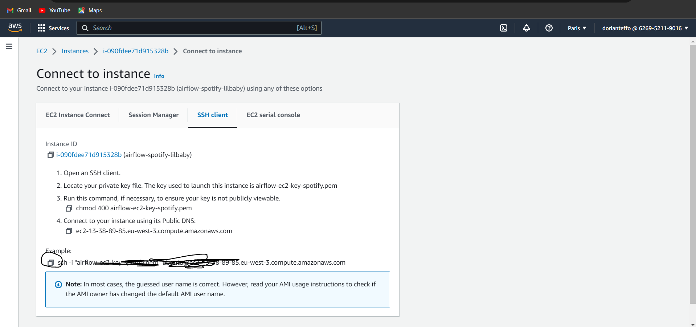
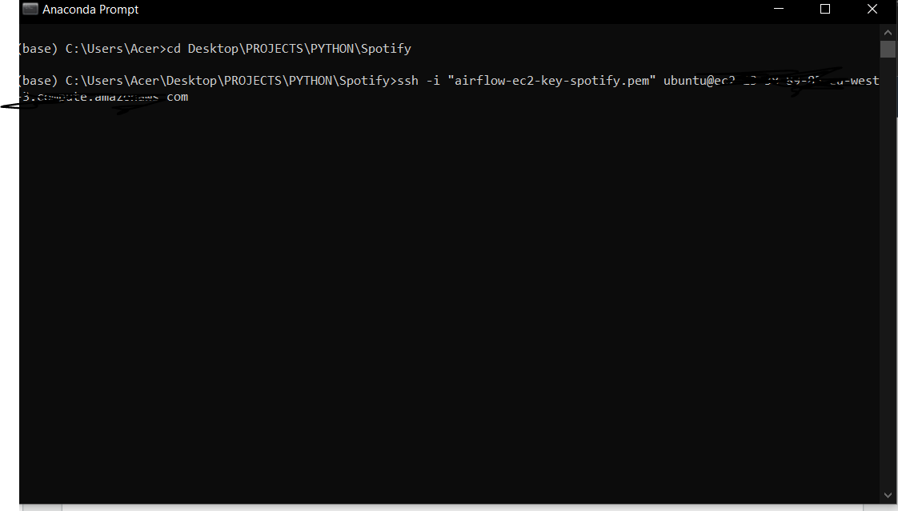

We then installed all the packages required with these commands on the terminal : 

sudo apt-get update
sudo apt install python3-pip
sudo pip install apache-airflow
sudo pip install pandas
sudo pip install python-dotenv
sudo pip install requests
sudo pip install s3fs

After installing all the packages, we went to the airflow folder on our terminal using : cd airflow. 

And then created a new folder named spotify_dag using : mkdir spotify_dag. 

We moved inside the folder using cd spotify_dag and created our spotify_etl.py, spotify_dag.py and modules.py  files with the same codes as on our main project folder using : sudo nano spotify_etl.py , sudo nano spotify_dag.py and sudo nano modules.py.

After copying all the codes in each file, we went inside the airflow folder, and used this command  sudo nano airflow.cfg, to modify the dags_folder and put spotify_dag:
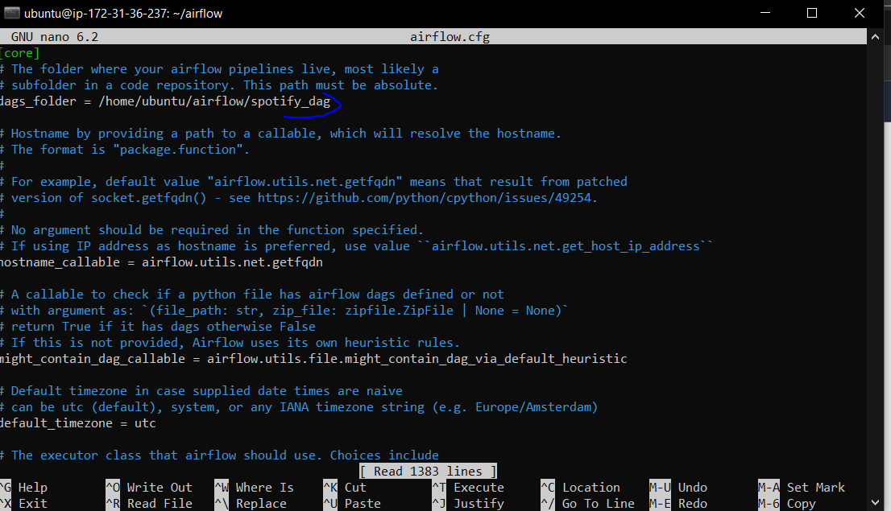

We were then good to run our airflow dag using this command : airflow standalone.
After running this command, we had to go on the settings of our EC2 instance, and add one inbound rule to access the airflow webserver on our local machine using the Public DNS provided on the EC2.
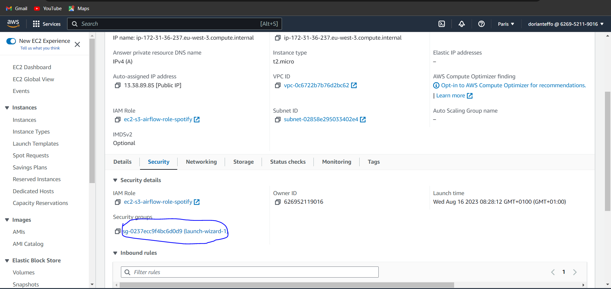
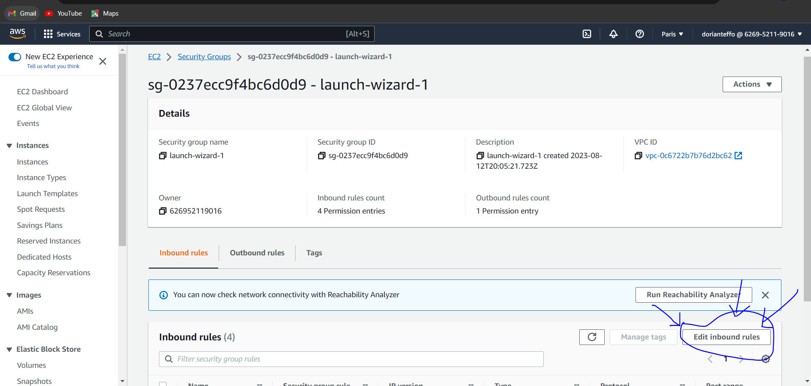
For this project, we just added a simple inbound rule: 
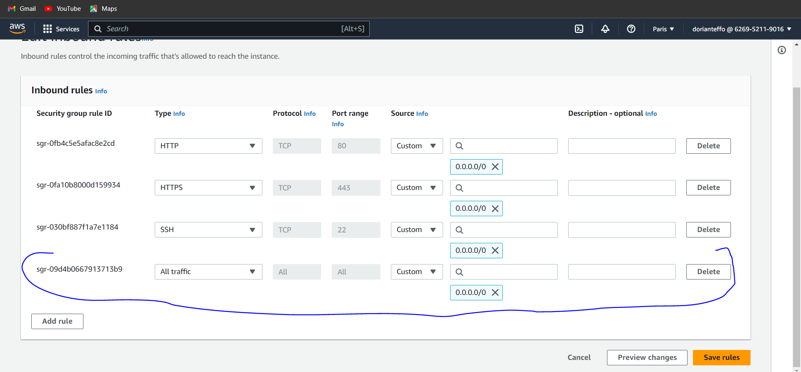

We then ran the airflow webserver using the Public IPv4 DNS provided on the EC2 properties and added “:8080” at the end of the link ( because it the default port for Airflow ). 

After all this steps, we ran our DAG manually on the Airflow webserver :
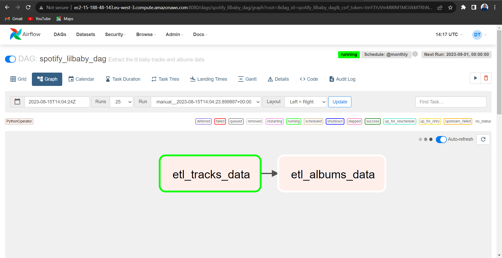
We had to deal many errors, but after few minutes of debugging, the DAG ran successfully.
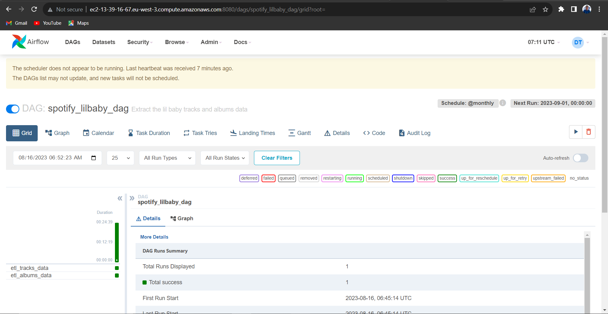

The two datasets were uploaded in our S3 bucket: 
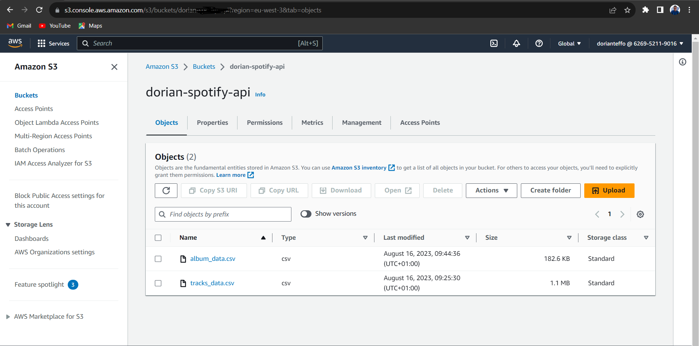

## EDA
On this part, we focus on : 
* Best songs 
* Best albums
* Featurings
* Tracks duration
* Popularity 

You can check this Exploratory Data Analysis on the notebook file for more details and findings.

